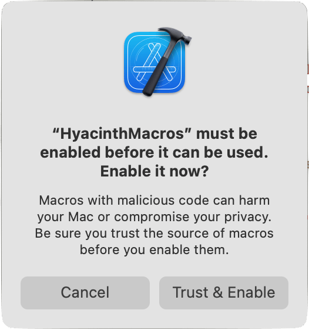

# Hyacinth


This repository contains a collection of macros designed to enhance productivity and safety in Xcode development. Currently, it features the `#URL` macro, which provides a safer alternative to URL creation by validating URLs at compile time, and the `@EnvironmentKey` macro, which simplifies defining custom SwiftUI environment keys.

## Features

- **`#URL` Macro**: A safer way to create URLs from string literals, ensuring validity at compile time.
- **`@EnvironmentKey` Macro**: Easily define custom SwiftUI environment keys and storage with less boilerplate.

### `#URL` Macro

The `#URL` macro offers a secure method to create URLs from string literals. It checks the validity of the URL at compile time, preventing runtime errors due to malformed URLs.

#### Usage

To use the `#URL` macro, import the `Hyacinth` module in your Swift file:

```swift
import Hyacinth
```

Then, you can create URLs safely:

```swift
let url = #URL("https://example.com")
```

This is equivalent to:

```swift
let url = URL(string: "https://example.com")!
```

However, the `#URL` macro ensures that the URL is valid at compile time, providing an additional layer of safety.

### `@EnvironmentKey` Macro

The `@EnvironmentKey` macro helps you define custom SwiftUI environment keys and their storage with minimal boilerplate. It generates the necessary key struct and accessors for use with SwiftUI's environment system.

#### Usage

To use the `@EnvironmentKey` macro, import the `Hyacinth` module and apply the macro to a variable inside an `EnvironmentValues` extension:

```swift
import Hyacinth

extension EnvironmentValues {
    @EnvironmentKey
    var value: Int = 1
}
```

This will generate:

- An `EnvironmentKey_value` struct conforming to `EnvironmentKey`
- Storage and accessors for `value`

You can then use `value` with SwiftUI's `@Environment` property wrapper.

> **Note:** The macro must be applied to a variable inside `EnvironmentValues`.

## Getting Started

To get started with these macros, follow the instructions below:

1. **Clone the Repository**: Clone this repository to your local machine.
2. **Integrate with Xcode**: Follow the integration steps to use these macros in your Xcode project. When you first use the macros, Xcode will show a dialog:

   ```
   "HyacinthMacros" must be enabled before it can be used. Enable it now?
   ```

   You are advised to read the macro code before pressing the "Trust & Enable" button. For more details, see the screenshot below:
   
   

3. **Start Using Macros**: Use the `#URL` macro in your code to ensure safe URL creation.

## Running on CI

To enable the macros on CI add the following line to your build steps:

```sh
defaults write com.apple.dt.Xcode IDESkipMacroFingerprintValidation -bool YES
```

### Xcode Cloud

For Xcode cloud this line could be added to file `ci_scripts/ci_post_clone.sh`

## License

This project is licensed under the MIT License. See the [LICENSE file](LICENSE) for details.

---
